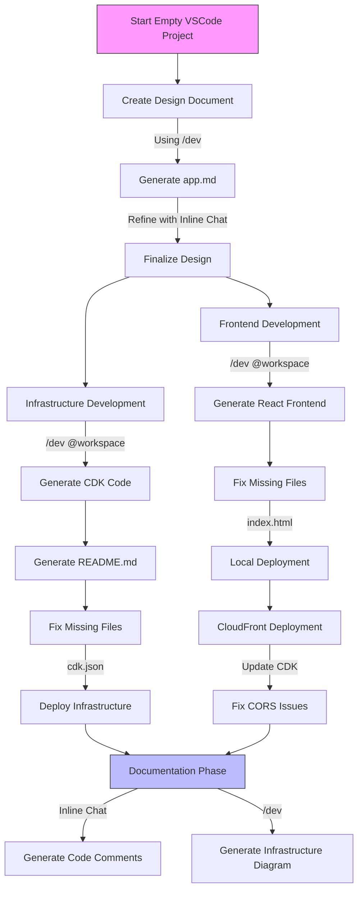

# DevFlow Task Management Application
This README.md was generated using Amazon Q developer and serve as a sample.
All the code present in this repository was generated using Amazon Q developer and is not to be used/deployed in production.

you can find the blog article discussing the building of this solution here: https://community.aws/content/2p73nqxh4q5VwCQDA8bQqgaLsdA/all-the-new-things-q-developer-can-do

if you want to understand the prompting flow:


A serverless task management application built with AWS CDK and Lambda functions.

## Overview

This application provides a serverless backend for managing tasks using AWS services. It includes:
- Lambda functions for CRUD operations on tasks
- Infrastructure as Code using AWS CDK
- TypeScript implementation

## Prerequisites

- Node.js (v14.x or later)
- AWS CLI configured with appropriate credentials
- AWS CDK CLI installed (`npm install -g aws-cdk`)

## Project Structure

```
├── infrastructure/    # CDK infrastructure code
│   ├── bin/          # CDK app entry point
│   └── lib/          # CDK stack definition
└── lambda/           # Lambda functions
    ├── create-task/  # Create task function
    ├── delete-task/  # Delete task function
    ├── get-tasks/    # Get tasks function
    └── update-task/  # Update task function
```

## Installation

1. Clone the repository
2. Install dependencies:
   ```bash
   # Install infrastructure dependencies
   cd infrastructure
   npm install

   # Install Lambda dependencies
   cd ../lambda
   npm install
   ```

## Deployment

1. Bootstrap your AWS CDK environment (if not already done):
   ```bash
   cdk bootstrap
   ```

2. Deploy the stack:
   ```bash
   cd infrastructure
   cdk deploy
   ```

## Development

### Infrastructure
- The CDK stack is defined in `infrastructure/lib/devflow-stack.ts`
- Configuration and app entry point is in `infrastructure/bin/devflow.ts`

### Lambda Functions
Each Lambda function is contained in its own directory with its TypeScript source code:
- `create-task`: Creates new tasks
- `delete-task`: Deletes existing tasks
- `get-tasks`: Retrieves tasks
- `update-task`: Updates existing tasks

## Testing

To run tests:
```bash
npm test
```

## Author

Gengis BIRSEN

## License

MIT License

Copyright (c) 2024 Gengis BIRSEN

Permission is hereby granted, free of charge, to any person obtaining a copy
of this software and associated documentation files (the "Software"), to deal
in the Software without restriction, including without limitation the rights
to use, copy, modify, merge, publish, distribute, sublicense, and/or sell
copies of the Software, and to permit persons to whom the Software is
furnished to do so, subject to the following conditions:

The above copyright notice and this permission notice shall be included in all
copies or substantial portions of the Software.

THE SOFTWARE IS PROVIDED "AS IS", WITHOUT WARRANTY OF ANY KIND, EXPRESS OR
IMPLIED, INCLUDING BUT NOT LIMITED TO THE WARRANTIES OF MERCHANTABILITY,
FITNESS FOR A PARTICULAR PURPOSE AND NONINFRINGEMENT. IN NO EVENT SHALL THE
AUTHORS OR COPYRIGHT HOLDERS BE LIABLE FOR ANY CLAIM, DAMAGES OR OTHER
LIABILITY, WHETHER IN AN ACTION OF CONTRACT, TORT OR OTHERWISE, ARISING FROM,
OUT OF OR IN CONNECTION WITH THE SOFTWARE OR THE USE OR OTHER DEALINGS IN THE
SOFTWARE.