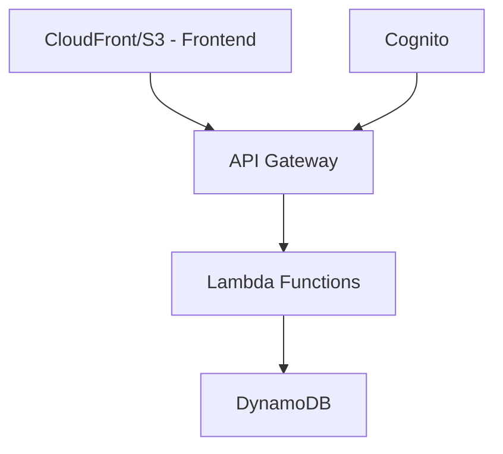
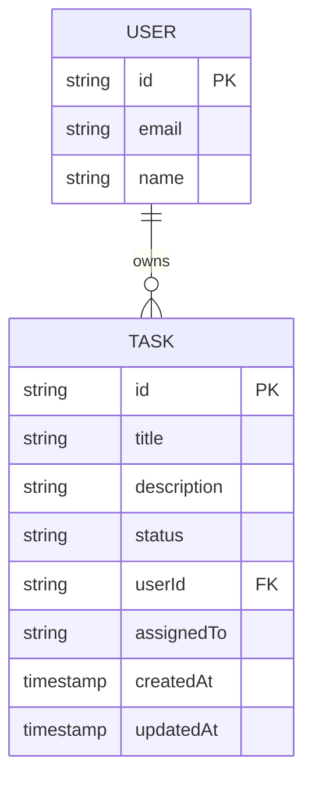

# DevFlow: Simple Task Management System

## Overview
A lightweight task management system built on AWS serverless architecture, focusing on core features with room to grow.

## Core Features
- Create and manage tasks
- Basic user authentication
- Task status updates
- Simple task assignment

## Technical Requirements
- Serverless AWS architecture
- Database that scales to zero
- Simple authentication
- REST API

## Architecture

### Frontend
- Single page React application
- Hosted on S3 + CloudFront

### Backend
- API Gateway + Lambda functions
- DynamoDB (on-demand capacity)
- Cognito for authentication

## Data Model

## API Endpoints

### Tasks
- GET /tasks - List tasks
- POST /tasks - Create task
- PUT /tasks/:id - Update task
- DELETE /tasks/:id - Delete task

### Users
- GET /users - List users
- GET /users/:id - Get user

## Security
- Cognito user pools
- API authentication via tokens
- CORS configuration

## Initial Tech Stack
- Frontend: React
- Backend: Node.js on Lambda
- Database: DynamoDB
- Authentication: Cognito
- API: REST via API Gateway

## Development Phases

### Phase 1: Core Features
- Basic CRUD for tasks
- User authentication
- Task listing and filtering

### Phase 2 (Future)
- Real-time updates
- Task comments
- File attachments
